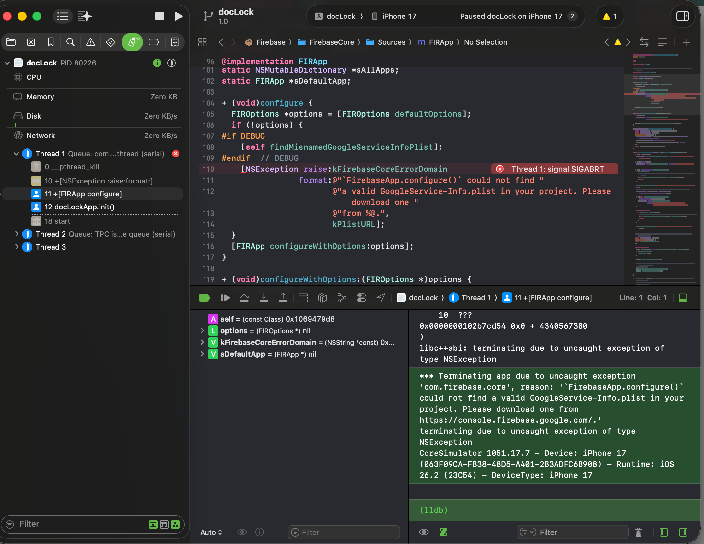

# Team Setup Guide for DocLock Project

This guide explains how new team members can set up and run the DocLock project on their own machines with different configurations.

---

## 🔧 Setup Requirements

Each developer will need:
1. **Different Firebase Project** → Different `GoogleService-Info.plist`
2. **Different Project Path** → Works automatically (relative paths used)
3. **Different Bundle ID** → For device testing with their Apple ID

---

## 📁 Step 1: Clone & Initial Setup

### 1.1 Clone the Repository
```bash
git clone <repository-url>
cd docLock
```

### 1.2 Open Project in Xcode
- Open `docLock.xcodeproj` in Xcode
- Let Xcode resolve Swift Package dependencies (Firebase)

---

## 🔥 Step 2: Setup Firebase (GoogleService-Info.plist)

### Option A: Use Your Own Firebase Project (Recommended for Development)

1. **Create/Get Your Firebase Project:**
   - Go to [Firebase Console](https://console.firebase.google.com/)
   - Create a new project OR use an existing one
   - Add an iOS app with your bundle ID (see Step 3)

2. **Download GoogleService-Info.plist:**
   - In Firebase Console → Project Settings → iOS Apps
   - Download the `GoogleService-Info.plist` file

3. **Replace the File in Xcode:**
   - **DO NOT** commit your `GoogleService-Info.plist` to git (add to `.gitignore`)
   - In Xcode: Right-click `GoogleService-Info.plist` → Delete (Remove Reference)
   - Drag your new `GoogleService-Info.plist` into the project root
   - ✅ Check "Copy items if needed"
   - ✅ Select your target: `docLock`

4. **Verify Firebase Initialization:**
   - Check `App/docLockApp.swift` - `FirebaseApp.configure()` should work
   - Make sure the file is in Resources build phase (should be automatic)

### Option B: Use Shared Development Firebase Project

1. **Get GoogleService-Info.plist from Team Lead:**
   - Team lead shares the `GoogleService-Info.plist` file securely
   - **DO NOT** commit this file to git (should be in `.gitignore`)

2. **Add to Project:**
   - Drag `GoogleService-Info.plist` into project root in Xcode
   - ✅ Check "Copy items if needed"
   - ✅ Select your target: `docLock`

---

## 📱 Step 3: Setup Bundle ID for Your Apple ID

### Why Different Bundle IDs?

Each developer needs their own bundle ID because:
- Only one Apple Developer account can use a bundle ID
- You can't sign apps with a bundle ID registered to someone else's account
- This allows each developer to test on physical devices

### Setup Steps:

#### 3.1 Create Your Development Bundle ID

**Format:** `com.techvriksha.doclock.dev.{yourname}`

**Examples:**
- Pranav: `com.techvriksha.doclock.dev.pranav`
- Apeksha: `com.techvriksha.doclock.dev.apeksha`
- John: `com.techvriksha.doclock.dev.john`

#### 3.2 Update Bundle ID in Xcode

**Method 1: Create Your Own Scheme (Recommended)**

1. **Create Build Configuration:**
   - Xcode → Project (docLock) → Info tab
   - Under "Configurations", click "+" → Duplicate "Debug"
   - Name it: `Debug-{YourName}` (e.g., `Debug-Pranav`)

2. **Set Bundle ID Variable:**
   - Xcode → Project (docLock) → Build Settings tab
   - Search for "Product Bundle Identifier"
   - Expand and set:
     - `Debug-{YourName}`: `com.techvriksha.doclock.dev.{yourname}`

3. **Create Scheme:**
   - Product → Scheme → Manage Schemes
   - Click "+" → Name: `docLock-{YourName}`
   - Set Build Configuration to `Debug-{YourName}`

**Method 2: Manual Change (Quick but needs switching)**

1. Xcode → Project (docLock) → TARGETS → docLock → General
2. Change "Bundle Identifier" to: `com.techvriksha.doclock.dev.{yourname}`
3. Remember to change back before committing (or use git hooks)

#### 3.3 Register Bundle ID in Apple Developer Portal (If Testing on Device)

1. Go to [Apple Developer Portal](https://developer.apple.com/account/)
2. Certificates, Identifiers & Profiles → Identifiers
3. Click "+" → App IDs → Continue
4. Enter:
   - **Description:** DocLock Dev - {YourName}
   - **Bundle ID:** `com.techvriksha.doclock.dev.{yourname}`
5. Select capabilities (if needed): Push Notifications, etc.
6. Register

#### 3.4 Update Firebase for Your Bundle ID

If using your own Firebase project:
1. Firebase Console → Project Settings → iOS Apps
2. Add iOS app OR edit existing app
3. Bundle ID: `com.techvriksha.doclock.dev.{yourname}`
4. Download new `GoogleService-Info.plist` if needed

---

## 🔐 Step 4: Setup Signing & Certificates

### 4.1 Automatic Signing (Easiest)

1. Xcode → Project (docLock) → TARGETS → docLock → Signing & Capabilities
2. ✅ Check "Automatically manage signing"
3. Select your **Team** (your Apple Developer account)
4. Xcode will create provisioning profile automatically

### 4.2 Manual Signing (If needed)

1. Create Provisioning Profile in Apple Developer Portal
2. Download and install in Xcode
3. Select in Signing & Capabilities

---

## ⚙️ Step 5: Project Path (Already Handled!)

**Good News:** ✅ Project paths are already relative!

The project uses relative paths like:
- `path = "Sources/docLock/App/docLockApp.swift"` (not absolute paths)

**This means:**
- ✅ Works on any machine
- ✅ Works with any project path
- ✅ No changes needed when cloning

**Just clone and open - paths work automatically!**

---

## 📝 Step 6: Git Configuration

### 6.1 Create .gitignore (If Not Exists)

Create/update `.gitignore` to exclude personal files:

```gitignore
# Personal GoogleService-Info files
GoogleService-Info-*.plist
GoogleService-Info.plist

# Xcode user-specific files
xcuserdata/
*.xcuserstate
*.xcuserdatad/

# Build products
build/
DerivedData/

# Personal schemes
*.xcscheme

# OS files
.DS_Store
```

### 6.2 Commit Shared Configuration Only

**DO commit:**
- ✅ `GoogleService-Info.plist.template` (if created)
- ✅ Project structure and code
- ✅ Shared configuration files

**DON'T commit:**
- ❌ Your personal `GoogleService-Info.plist`
- ❌ Your personal bundle ID changes (if manual)
- ❌ `xcuserdata/` folder

---

## 🚀 Step 7: Build & Run

### 7.1 Select Your Scheme

1. Xcode → Scheme dropdown (top toolbar)
2. Select: `docLock-{YourName}` OR `docLock` with your bundle ID

### 7.2 Select Device/Simulator

- Choose iOS Simulator OR
- Your physical device (if configured)

### 7.3 Build & Run

- Press `Cmd + R` or click Run button
- App should build and run with your configuration

---

## 🏗️ Recommended Project Structure

### Shared Bundle IDs:
```
com.techvriksha.doclock.dev.pranav    (Pranav's development)
com.techvriksha.doclock.dev.apeksha   (Apeksha's development)
com.techvriksha.doclock.staging       (Shared staging for testing)
com.techvriksha.doclock               (Production - one shared)
```

### Firebase Projects:
- Each developer can use their own Firebase project for development
- OR share one development Firebase project (add multiple bundle IDs to it)
- One staging Firebase project (shared)
- One production Firebase project (shared)

---

## 📋 Checklist for New Developers

- [ ] Clone repository
- [ ] Open project in Xcode
- [ ] Let Swift Package Manager resolve dependencies
- [ ] Get `GoogleService-Info.plist` (own Firebase OR from team lead)
- [ ] Add `GoogleService-Info.plist` to project
- [ ] Create bundle ID: `com.techvriksha.doclock.dev.{yourname}`
- [ ] Update bundle ID in Xcode (scheme or manual)
- [ ] Setup code signing (Automatic signing recommended)
- [ ] Register bundle ID in Apple Developer Portal (if testing on device)
- [ ] Update Firebase with your bundle ID (if using own Firebase)
- [ ] Add `GoogleService-Info.plist` to `.gitignore`
- [ ] Select your scheme
- [ ] Build and run successfully

---

## 🔄 Switching Between Developers

### To Work on Your Version:
1. Select your scheme: `docLock-{YourName}`
2. Use your `GoogleService-Info.plist`
3. Bundle ID automatically uses your version

### To Test Shared Staging:
1. Switch to `docLock-Staging` scheme
2. Use staging `GoogleService-Info.plist`
3. Bundle ID: `com.techvriksha.doclock.staging`

---

## 🆘 Troubleshooting

### Issue: "GoogleService-Info.plist not found"
**Solution:**
- Make sure file is in project root
- Check it's in Resources build phase
- Verify file name is exactly `GoogleService-Info.plist`

### Issue: "Bundle ID already in use"
**Solution:**
- Use a different bundle ID with your name
- Or use your own Apple Developer account

### Issue: "Code signing failed"
**Solution:**
- Enable Automatic Signing
- Select correct Team
- Make sure bundle ID is registered in Apple Developer Portal

### Issue: "Firebase not initialized"
**Solution:**
- Check `GoogleService-Info.plist` is correct for your bundle ID
- Verify `FirebaseApp.configure()` in `App/docLockApp.swift`
- Check file is added to target

---

## 📚 Additional Resources

### Firebase Setup:
- [Firebase iOS Setup Guide](https://firebase.google.com/docs/ios/setup)

### Apple Developer Setup:
- [Apple Developer Portal](https://developer.apple.com/account/)
- [Code Signing Guide](https://developer.apple.com/support/code-signing/)

### Xcode Schemes:
- [Managing Schemes](https://developer.apple.com/documentation/xcode/managing-schemes)

---

## 👥 For Team Leads

### Setup Tasks:

1. **Create .gitignore** with Firebase files excluded
2. **Document shared bundle IDs** in README or this guide
3. **Provide GoogleService-Info.plist template** (optional):
   - Create `GoogleService-Info.plist.template` with placeholder values
   - Developers copy and fill in their values

4. **Create shared schemes** in Xcode:
   - `docLock-Staging` (for shared staging testing)
   - Keep developer-specific schemes as local (don't commit)

5. **Coordinate Firebase projects:**
   - Decide: Individual Firebase projects OR shared development project
   - Document Firebase project IDs and how to access

---

## ✅ Verification

After setup, verify:

1. ✅ Project builds without errors
2. ✅ Firebase initializes (check console logs)
3. ✅ App runs on simulator/device
4. ✅ API calls work (check network logs)
5. ✅ No personal files committed to git

---

**Last Updated:** January 17, 2026  
**Project:** DocLock iOS Application
